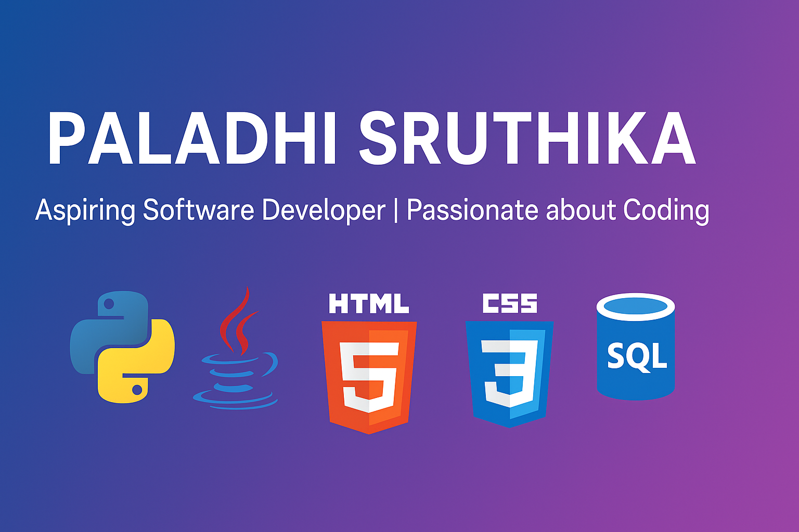

<!-- Header -->
<h1 align="center">Hi 👋, I'm Sruthika Paladhi </h1>
🎓 Aspiring Software Developer | 💻 Passionate about Coding | 📊 Interested in Python Programming & Web Development  

<!-- Profile Image -->

  

---

<!-- About Me -->
## About Me
I am passionate about building projects that solve real-world problems. I have hands-on experience in **Python, Java, HTML, CSS, and JavaScript**. I enjoy learning new technologies and contributing to open-source projects.

---

<!-- Skills / Tech Stack -->
## 🛠 Skills & Tools

  
  
  
  
  
  
  
  

---

<!-- Projects -->
## 🚀 Projects
| Project | Description | Link |
|---------|-------------|------|
| **Quiz App** | Python-based quiz application for creating and taking quizzes | [GitHub](https://github.com/sruthika2811/QuizApp.git) |

---

<!-- GitHub Stats -->
## 📊 GitHub Stats

  
  

---

<!-- Contact -->
## 📫 Connect with Me

  
  

---

“Strive to build, learn, and grow every day!”

